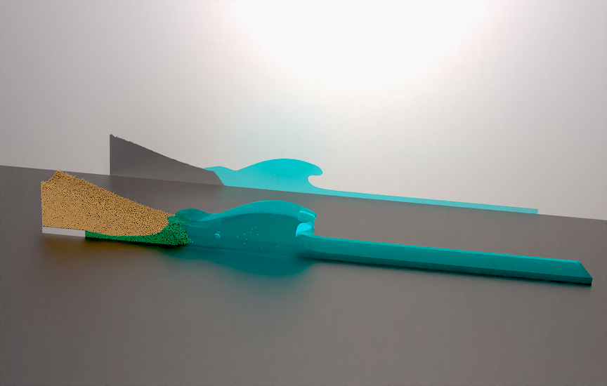

# Particle bed collapse into a pool, forming a wave

- This case studies the collapse of a granular column into a pool of water following the experiments described in [Robbe-Saule M, Morize C, Henaff R, Bertho Y, Sauret A, Gondret P. Experimental investigation of tsunami waves generated by granular collapse into water. Journal of Fluid Mechanics. 2021;907:A11](https://doi.org/10.1017/jfm.2020.807).
- The bed can be formed by running the `bedmaker` case using the `input.bedmaker` file as input.
- The case is dimensional.
- The case uses its own specialized `lpt_class.f90` file.
- To do:
    - Test added mass (currently implemented but not used).
    - Add improved models for lift and added mass, based for example on [Çalışkan U, Mišković S, Analysis of particle dispersion and cavity formation during bulk particle water entry using fully coupled CFD-DEM-VOF approach. Particuology. 2024;90:558-580](https://doi.org/10.1016/j.partic.2023.12.018).
    - Add proper friction model for particle collisions (could test angle of repose for validation).
    - Add 3mm fixed particles at the bottom of the pool to mimic experiments.

The figure below shows a snapshot of the simulation at $t=0.55$ s rendered using the `collapse_render.pvsm` Paraview state (generated with version 5.13.0).

