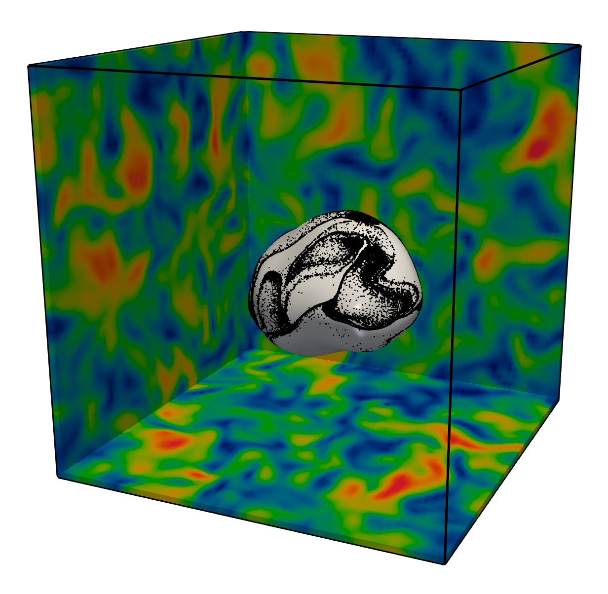

**Droplet in Homogeneous-Isotropic-Turbulence**

- The density and viscosity ratios are fixed to 1. This allows us to use a FFT-based Poisson solver (adding a dependency on FFTW)
- The specific quantities to set in this example are:
    - `Droplet diameter`, `position`, and `injection time` (which is expressed in terms of eddy-turnover times)
    - The `Weber number`, defined as in [Risso, F. & Fabre, J. 1998 Oscillations and breakup of a bubble immersed in a turbulent field. J. Fluid Mech. 372, 323–355](https://doi.org/10.1017/S0022112098002705)
    $$ \mathrm{We} = \dfrac{2 \rho \epsilon^{2/3} d^{5/3}}{\sigma} $$    - The - - The `Reynolds number` based on the Taylor microscale $\lambda$, defined as in
    $$ \mathrm{Re}_\lambda = \dfrac{U_\mathrm{rms} \lambda}{\nu} $$
    If not specified, the $\mathrm{Re}_\lambda$ will be chosen as the maximum value allows by the number of grid points.
    - The `Number of tracers`, specifying how many (optional) fluid tracers we want to seed on the droplet's surface.

